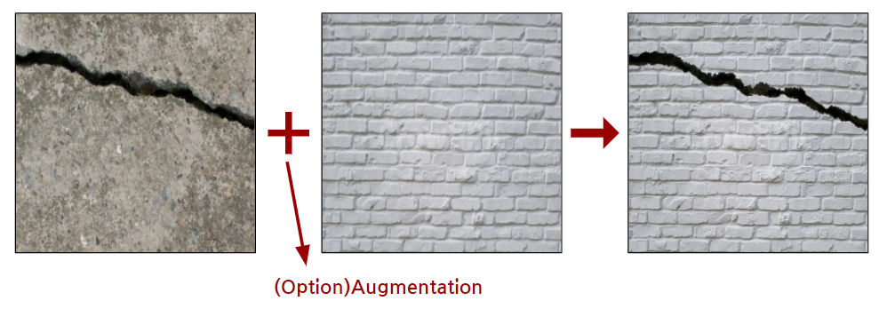
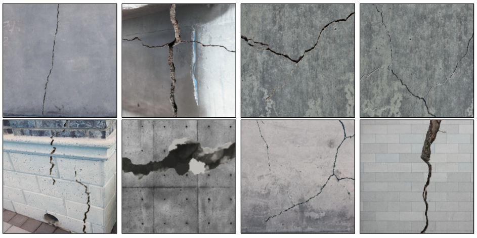

# installation
---
```
pip install imgaug
```
If you don't have 'opencv' module, you are able to use below code.
```
pip install opencv-contrib-python
```

# Guide
---
```
crack_maker
│   main.py
│   README.md
└───image
│       crack001.jpg
│       crack002.jpg
└───mask
│       mask001.jpg
│       mask002.jpg
└───background
│       back001.jpg
│       back002.jpg
└───output
    └───images
    |       cvt_crack001.jpg
    |       cvt_crack002.jpg
    └───masks
            cvt_crack001.jpg
            cvt_crack002.jpg
```
1. Input your crack images in the image directory. These images can even contain the non-crack patterns that you want to put into the background.
2. Input your masking images in the mask directory. Remember that crack image's name and masking image's name should be the same.
3. Input your background images where you want to put the pattern in the background directory.

# Usage
---
```
python main.py
```

If you want to make crack generator with augmentation, you are able to set -augmetnation True like below code.
```
python main.py -augmentation True
```

# Example

The image below is a brief description of the contents of this repo.<br>



The image below is the result of applying this repo.

